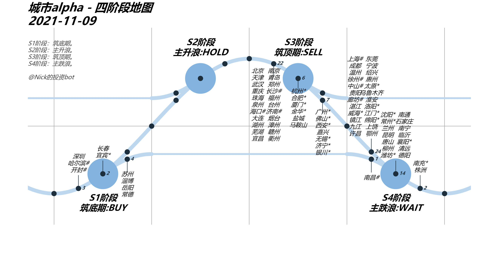
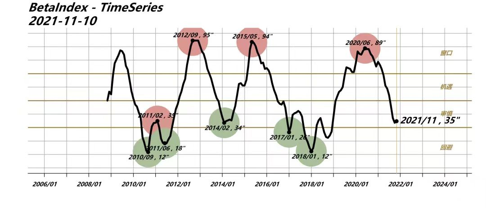
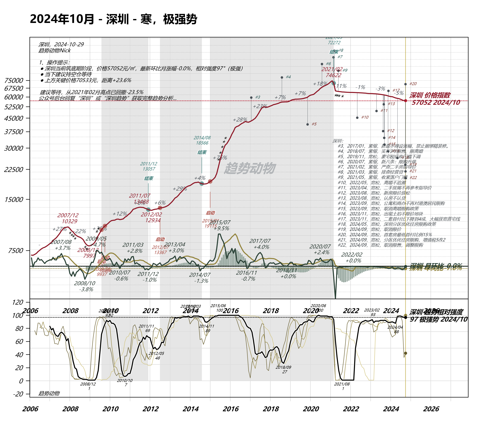

# 趋势动物

免责声明：不构成投资建议，请谨慎操作。

量化，房产K线

## 一、发现新大陆

在冰上指数知识星球看到一则分享内容：楼市周期，全体楼市离开主升浪，立冬只是冬天的开始；并看到如下配图：城市alpha-四阶段地图。但并没有什么反应，直到看到这个顿时来了好奇心。



Beta就是整体环境的挣钱效应，在多头市场看多，在空头市场看空；附配图：BetaIndex - TimeSeries。这不就是房地产价格K线？于是我开始想方设法去找到内容的源头。



功夫不负有心人，最终还是在微信公众号翻到了，对于数据天然敏感的我，就像捡到宝一样，放在手掌心开始认真地把玩起来。

## 二、爱的初体验

咋一眼望去像是正规产品。公众号排版挺不错的，数据绘的图片也不错，简单易懂，尤其配色还可以。

当个房价数据源也不错。输入城市名称关键字-深圳，可以看到06到24年的阶段性房价。11年7月价格为13488，21年2月价格为74622，24年10月最新价格为57052。自从房住不抄后，甚至在公开互联网要找到一份详实可参考的房价数据都很难，哪怕你拿他当做各个城市房价数据源也是不错的。

```text
深圳价格关键点
2024/10 57052
2021/02 74622
2015/01 19115
2012/02 12934
2008/12 7997 
2007/12 10329
```

追溯历史房价走势。输入关键字-深圳趋势，可以看到深圳行情历史记录。假如你经历过大行情的话，此时此刻你会突然明白这个道理：刚需买就完了。

```text
2021/02-2024/10 跌幅23.6%
2015/01-2021/03 涨幅278%
2012/07-2014/08 涨幅38%
2008/12-2011/12 涨幅31%
```

看到眼前的数字，还可以这样买房？无数个不眠之夜，在担心完房价涨，仓促上车，又继续担心放假跌。此时此刻，似乎自己像个小丑。



## 三、深入研读

### 1、关于作者

一直崇尚量化交易，之前在一家地产总部做投资和propTech的工作，有幸向优秀的前辈们一起研究投资实战，专注于用定量的方法，挖掘可以预测房价的因子和跟踪全国的趋势。现在仍然在做价格运动的研究，只是切换了赛道，以一名全职量化研究员，观察国内的期货和股票市场为主。

开始写公众号的初心，是我发现楼市和股市的价格运动规律是惊人的相同，其中涉及的投机方法也是出于一致。价格总是一种特定的方式自发运动、重复，并在特定的时期发出明确的看涨或离场信号。自己也成为了坚定的趋势投机者，投机是一门学科，严格按市场规律行事，一定能有所收获。量化方法又是趋势跟踪非常好的工具，可以高效的同时跟踪各类资产所有标的的行情记录，了解各大类资产和板块所处的位置，同时也保证了不会错过主趋势行情。

输出是最好的输入，输出也是提高思考质量的好方法。

如果你相信市场是对的，有记录行情的习惯，认为好的机遇需要等待。如果你偏爱右侧交易，买价格看起来高的，而不是热衷抄底，不越低越买。如果你信奉投机交易，比如标的合约持仓不会超过两个月，而不是信奉价值投资。

那么趋势投机笔记欢迎你这样的朋友，期待更多交流。

### 2、基础知识

#### 2.1 纯多头策略

纯多头策略。在熊市下保持中低的仓位，最大程度保护本金。在趋势行情来临之后，能快速跟上趋势，获取稳定的盈利。市场没有两个方向，牛的方向或熊的方向，市场只有一个方向，那就是正确的方向。

> 他们的价格运动，替代了他们的研报，发出了他们是强者的清晰信号。如果你相信市场是正确的，他们就是强者，他们大概率将在下一轮行情中引领市场，他们大概率将充当领头羊的角色，他们大概率还会回馈更惊喜的业绩。我们应该选择强者。

逢低吸纳的价值投资者，相信市场是错的，从市场定价的错误中，逆势买入，获取超额的收益。但对于我来说，我坚定的相信市场是正确的。也许我是错的，别人是对的。但我买入的标的，如果价格出现疲软，将毫不犹豫的止损。止损是认错，认错的代价很小，带来的溢价却很多。

> 严格执行止损规则的投机者，几乎不会有被套的风险。同时保证了投机者始终站在市场正确的一边。

自己比较舒服的买点，是突破ATH的时刻，这里的ATH（All Time High）就是创下历史新高的意思。

> 拿上海作为例子，<br>
> 2009年7月，上海房价创下历史新高—14281元；<br>
> 2012年10月，上海房价创下历史新高—18632元；<br>
> 2015年6月，上海房价创下历史新高——25633元；<br>
> 虽然不是最低点，但事实上，他们都是非常令人满意的买点。

如果你想持有一只潜在的十倍股，并开始着手研究复盘过去十倍股的规律，你可以会假设:
- 他们的财务增长都很优秀
- 他们处在较宽松的货币环境- 他们处在最好的赛道
- 他们的体量在赛道中处于一个合适的位置这些可能都对，也可能错。

但以下这句十倍股的判断，我可以向你保证一定是对的，这句话影响我非常深远：

> 一个十倍股，必须先涨一倍。一个十倍股，必须先创新高。<br>
> 一个十倍股，必须先涨一倍。一个十倍股，必须先创新高。<br>
> 一个十倍股，必须先涨一倍。一个十倍股，必须先创新高。

#### 2.2 康波周期

研究太阳黑子运动。周期研究的尽头大概是太阳黑子。太阳光能是所有生物活动的能量源头，经济又是所有社会活动的统计。最近找到了太阳黑子的公开高频数据，太阳黑子呈现显著的周期规律，但周期步长却并不是恒定值，从量化的角度，也许黑子周期是一个重要的自变参，甚至能为趋势研究提供额外的alpha。


太阳黑子数量呈现10-12年的显著周期性特征，波动性也不小。大型的金融危机发生在黑子数量下行期，尤其是谷底时期——天文上称之为蒙德极小期。好消息是，2021年以后的2-4年预计都将是黑子数量的上行期。经济预期最差的时期大概率已经过去。

#### 2.3 右侧交易

### 3、楼市周期

人生就是一场康波。周金涛说，大周期嵌套着小周期，周期的模数是产能周期，通常事3年。

> 国内的地产市，三年一周期； 国内的权益市，六年一周期；国际的金融市，十二年一轮回。按周期的眼光，去看国内的价格运动，是挺有意思的。比如说一个观点：2008年9月 = 2014年2月 = 2021年11月。

2021年11月11日公众号发文。时间来到2024年8月30日，万科A，最低价格6.18元。当然，说这个并非质疑作者，这才是真实的市场。

> 最近很多人讨论这两天的地产股上涨，拿000002作为房地产指数，说三个事件点：2008年9月16日，万科A，最低价格3.25元；2014年2月26日，万科A，最低价格4.68元；2021年11月2日，万科A，最低价格17.52元。

#### 3.1 四阶段地图

四阶段地图，用来观察国内楼市市场的核心。图的基础有两个，包括楼市的短周期理论和价格数据（统计局指数和冰山指数）。纯量化没有涉及主观干预，基于纯价格因子，不含供求关系和基本面分析。

将楼市周期划分成四个阶段—S1、S2、S3、S4。其中S1为筑底期（BUY），较好的建仓时期。适合置业或建仓，如遇高Beta时期，适合加一定杠杆参与，此时投资很难亏损；其中S2为主升浪（HOLD），赚钱效应较强的时期。耐心持仓，不建仓，也不卖出，如有流动性强的标的，可以快进快出，但机会不多，建议多看少动；其中S3为筑顶期（SELL），最好的卖出时期，适合卖出或销售，投资置业会非常危险，此时投资非常容易出现亏损；其中S4为主跌浪（WAIT），负面新闻较多，但市场还没有进入底部区域，空仓等待更好的机会。

> 可以看到所有城市缓速的在四阶段地图曲线上进行变化。这幅图使用纯量化的方式，描绘出了所有城市所处周期的位置。随着时间的推移，所有城市的趋势只会顺着曲线向后推动。

> S2是主升浪段，考虑到卖出的时机，最好建仓期是S1。

#### 3.2 环境，Beta Index

判断多头或空头市场—Beta Index。在多头市场看多，在空头市场看空。基本面再好的城市或标的，在大环境处于空头市场的情况下，也很难从交易中获利。

Beta Index计算方法。根据四阶段城市的个数计算，处于S1阶段的城市越多，Beta越高，处于S3的城市越多，Beta越低。Beta高则意味着处于多头市场，Beta低则处于空头市场。

> 重要观点：只在多头市场买入！只在多头市场买入！只在多头市场买入！

窗口分级，将Beta分级为回避期、审慎期、机遇期、窗口期。其中Beta处于0-30（回避期），尽量不投资的谨慎期，亏损概率非常大，即持有现金优先，这个适合只有极少的城市能赚到钱，下跌或调整的城市是大多数。其中Beta处于30-50（审慎期），多看少动，少参与，扔不是投资的最好时候，投资失败的概率更大，只有极个别的城市能实现10-20%的涨幅。其中Beta处于50-70（机遇期），可以参与，寻找值得投资的城市，仍可以在一些城市投资，仍有部分城市实现年化10-20%的涨幅。其中Beta处于70-100（窗口期），值得重仓参与的置业窗口期，大部分城市可以投资，大周期的底部，大部分城市会有10-20%以上的涨幅，个别城市甚至可以涨幅更大。

> 2024年10月Beta=98，为有监测以来历史录得之最。

#### 3.3 楼市K线图

定制满足自己交易体系的图表。交易需要一张合格的图表，然而大部分交易软件都很难达到合格图表的标准。图表总是令人混淆不清，坚持做价格的行情记录。因此，必须对图表进行适当的改造，以满足自己的交易体系。

合格的图表应当具备对数坐标和阶段标注。

（a）对数坐标。投资收益永远是按rate of return(%)计量，因此永远应该采用对数坐标，而不是绝对值坐标。绝对值坐标不仅让标的价格波动的收益混淆不清，还误导了对行情的判断。抛弃传统的坐标轴，采用对数坐标。

> 举个例子，上海的平均房价2013-2014年H1，上海房价从1.9万元上涨到2.5万元，涨幅0.6万。2020-2021年H1，上海房价从5.4万元上涨到6.6万元，涨幅1.2万。如果用绝对坐标，一定能看到后者涨幅大两倍，K线也高得多， 然而如果你参与了市场，你的实际收益，前者是+31%，后者只有+22%。 一旦切换到对数坐标轴，坐标高度即收益率，十几年的收益走势非常清楚。

我们都应该记住，评价交易的不是价格涨幅，而是收益率。

> 很多人说上海最近一年（2020-2021）房价涨了很多，但事实上，过去五年，上海的房价涨幅相比二十年的历史，控制的很稳定。

（b）阶段标注。并不是任何时期的行情都是值得参与的。价格运动大部分时间就像随机的布朗运动，只在一些时期会发出明显的信号，预示着正在酝酿重大的价格运动。 是时候将这个标的纳入你的watchlist了，打起精神，密切关注他的价格波动，并等待适时的建仓信号或卖出信号。

对于楼市来说，S1阶段和S3阶段是值得标注的两个阶段。S1是适合买入的建仓区，S3是适合最佳卖出的出货区。

将S1、S3阶段作为价格运动图表的底色，显露出标的的周期性价格运动规律。对于上海楼市来说，上海上一个S1建仓阶段，是2018年12月-2020年6月。上海上一个S3出货阶段，是2021年5月-2021年10月。

市场就像"美林时钟"所阐述的那样，在S1-S2-S3-S4轮回，合格的图表应该能传达出这样的规律。

> 楼市周期：全体城市离开主升浪，立冬只是冬天的开始。

（c）买卖点。对于我来说，S1阶段的ATH突破交易一直是最安全的买点。S3阶段的衰竭点一直是最安全的卖点。总体对，但我也经常错。

合格的图表应该是能体现量化策略的图表，合格的买卖点建议应该是不包含未来函数的信号，当你有完整的交易体系，买卖点自然是清晰的，图表应该显露标注这些点的位置，你应该清晰的看到，哪里能吃肉，哪里会踏空，哪里会挨打。

> 投资不是赌博，是接受严格执行交易体系后的所有概率。


## 四、楼市感受

对居住环境提升的追求是存在的。根据自己在深圳常年居住的亲身经历，各式各样的房屋都曾深度的住过，包括：床位、城中村、小产权、公寓、商品房，居住面积也从床位、单间、一室一厅、两室一厅、三室一厅在逐步提高。在每一次搬家，住所环境的提高确实有带来居住品质的提升，因此我相信每个人对居住环境提升的追求是存在的。

## 五、实际应用

### 1、板块选筹模型

选筹模型里，四个方面非常重要：周期、城市、板块、资金。

> 对于周期，盯紧Beta Index即可；对于城市，盯紧城市所处的四阶段即可。

#### 1.1 新事物认识的规律

所有的板块，都从生到死，经历五个阶段。对于这五个阶段，Gartner的技术成熟度曲线是板块模型的最好解释。在投资中非常好用，屡试不爽。

先说Gartner每年会发布技术成熟度曲线，即Hype Curve：一个新技术从0→1，一定会经历这样五个阶段：

- 萌芽期：科技诞生的促动期，比如2019年的区块链比特币，2020年的无人驾驶。 
- 过热期：过高期望的峰值，大众媒体追捧炒作，比如在我看来现在的元宇宙就在这一阶段。
- 谷底期：泡沫化的低谷期，大量player离开赛道，行业兼并，融资热冷静下来。比如现在的无人驾驶。
- 攀升期：稳步攀升的光明期，产品不断升级，稳步提升，得到越来越多的用户群。
- 成熟期：实质生产的高峰期，比如当下的O2O、现代物流。


这张图非常经典，深刻的反映了群体对新事物认识的规律，值得反复记忆。

> 最好的买点在【谷底期】和【攀升期】，分享成长红利，最危险的买点在【过热期】，投资过后一地鸡毛。

#### 1.2 板块投资思路

讲到这里，板块的投资思路是完全一样的。不妨说，板块从0→1，一定也要经历这样五个阶段：

（a）板块的萌芽期：投资窗口期（信息门槛高）。规划发布前，政府的政策设计在酝酿过程，价格还未启动。比如2008年的上海虹桥新区、2012年的临港滴水湖，就是这样的区域。但绝大部分人，并不能提前获取到内幕信息，获取超额收益。

（b）板块的过热期：投资危险期。政府规划发布，媒体炒作、投资客大量入场。地价、房价大幅爬升，大幅跑赢全市平均涨幅。大多土地完成出让，但距离竣工普遍有至少3-5年时间。此时的投资是非常危险的，因为距离规划的兑现仍有较长的时间，而投资拥挤度是相对较高的，成本并不优。比如我认为，当下的上海南虹桥商务区就处在这个阶段。

（c）板块的谷底期：投资最佳窗口期！这里是一个板块最舒服的买点。大工地，大塔吊。施工密集开工期。由于规划的愿景未实现，等待失去耐心，但土地已完全出让，普遍在建设期，有的已经竣工，但招商未结束，空置率很高，距离片区整体进入交付竣工只有1-2年左右。唱衰的声音开始增加，甚至出现早期的地王销售惨淡，早期部分投资客开始离场。价格回归合理，涨幅开始跑输全市平均。2020年，西虹桥商务区已经度过了他的谷底期，距离城市界面的大幅提升仅有1-2年。

（d）板块的爬升期：投资持有期配套设施逐渐投入使用，写字楼陆续竣工招商。城市界面大幅提升，居民导入，商业配套逐渐成熟。价格重新稳步上涨，跑赢全市平均涨幅。

（e）板块的成熟期：卖出期。完全成熟、建成。土地完全出让，几乎没有新建设。价格达到稳定期，价格涨幅融入城市周期，跟随全市平均水平同涨跌。不再发生独立行情。上一批进入成熟期的上海新区有很多，比如徐家汇、瑞虹新城。

我最钟意的买点，是人口流入城市处于谷底期的商务新区板块。这类板块的特点就是：大工地、大塔吊、高空置率。

板块的谷底期是最好的买点，我自己的实践里，最喜欢的一类板块就是城市即将发展成熟的新区。大工地好，大塔吊好，高空置率好。

唱衰的声音并不可怕，只要：板块还在政府工作报告里的重点发展方向，板块参与的开发商仍在积极的建设、招商，板块的写字楼、商业供应远大于住宅的供应。那么其他投资者因为入场过早失去持有的耐心，也许就是你买入的机会。

#### 1.3 塔吊即黄金

这也是为什么我踩盘独爱去工地的原因：因为在这个逻辑体系下，塔吊即黄金。

怎么发现新区，看卫星图是最好的方法，各个区域的几个阶段通过鸟瞰地貌一目了然。再结合各地政府工作报告和十四五规划，很快可以清楚。

当然必须要提到的是并不是所有新区都能顺利走到成熟期，走到成熟期所花的时间也有长有短，差别巨大。

一个新区板块能否快速成熟，又涉及到另一个模型：
- 政府加持：市政府/省政府的搬迁，能极大程度的提升成熟速度。
- 能级加持：城市能级越高，成熟越快。
- 竞争符合：该城市同时打造的其他新区越少，成熟越快。
- 距离符合：新区距离老城中心（通常是市政府）距离越近，成熟越快。
- 面积符合：新区这个圈画的越小，成熟越快。
- 模式符合：商务功能的比重越大、住宅比重越小，成熟越快。

> 板块的买点，时机很重要。总结来说，大概就是——买生不买熟，买谷底不买过热，买塔吊不买星巴克。

### 2、八类城市

#### 2.1 相关性矩阵

统计学里有个东西叫相关性矩阵：用来聚类的。

输入变量是78个一二线城市的十五年房价涨跌幅走势（经过了标准化处理）。相关性矩阵，将这些城市聚成了八类。同类城市的涨跌节奏是强相关的。

#### 2.2 八个聚类
（a）领头羊。合肥、厦门、天津、北京、南京、广州、上海、深圳、珠海。
> 城运很强，市场的节奏总是充当领头羊的角色。

（b）慢熊。福州、济南、武汉、长沙、中山、南昌、石家庄、郑州。
> 也是强市，但总是后知后觉，慢人一步。这三四年，普遍调整了很久。

（c）3：骆驼。青岛、烟台、贵阳、太原。
> 曾经的明星，似乎最近开始走沙漠下坡路。但依然，瘦死骆驼比马大。

（d）4：压舱石。乌鲁木齐、沈阳、长春、绍兴、昆明、兰州。
> 西北、西南和东北的强市，市场周期总是和以上城市相反。 承接起了crisis alpha的功能，作为全国楼市下行的压舱石。绍兴，不知道怎么混进来了。

（e）丹顶鹤。大连、金华、泉州、西安、重庆。 
> 各个区域的明星，鹤立鸡群的市场明星。大连市场是东北的明星、金华是浙江的明星、泉州是福建的明星、西安是西北的明星、重庆是西南的明星。

（f）凤凰。南宁、徐州、常州、温州、杭州、宁波、无锡。
> 浴火涅槃，似乎城市基本面迎来了提升。价格的涨幅似乎得到了基本面的合理解释。哈尔滨，也不知道怎么混进来了。

（g）黑马/凤凰。
> 东莞、惠州。市场一开始是黑马，后来城运提升，似乎也变成了凤凰。也很难说清到底是黑马，还是凤凰。

（h）黑马。哈尔滨、海口、嘉兴、南通、台州。
> 黑马黑的发黑。涨了又涨，涨到怀疑人生。不知好运是否到头。

主观判断很可能会错，但市场永远是对的。聚类分析，似乎能将市场看的更清楚。